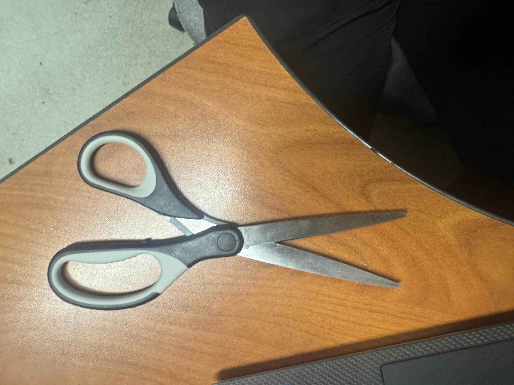
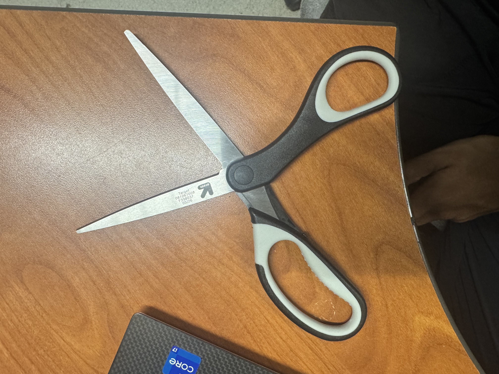

# A1 – [Topic]

## Analyze
https://fwachter.github.io/

This portfolio is put together very well. The portfolio is very organized in terms of where and what everything is. There isn't enough information to reproduce his work without asking questions. He has YouTube videos on the project and a way to contact him for more info on his projects. On the suferce their is only the final answer, but there are tabs on each project that no longer work. That probably had more info on each project. Yes, this portfolio is Professional in tone and how it looks. 

https://elchun.github.io/project_pages/maker_portfolio.html

This portfolio is easy to navigate because the projects are separated into individual pages and can be found quickly from the main portfolio page. There is enough information to understand what each project does, but it does not include enough dimensions, files, or step-by-step procedures for another person to reproduce the work without asking questions. The portfolio does show some evidence of reasoning because the author explains parts of the design process, the purpose of the projects, and some of the decisions made during development instead of only showing the final result. The language and layout are appropriate for an engineering portfolio because the pages stay focused on the projects, use technical descriptions, and include images and documentation that help explain the work.

Patent: US5421090A
Maker: Lian-Jen Chiou
Link: https://patents.google.com/patent/US5421090A/en?oq=us5421090a

The primary engineering function of the scissors is to apply opposing shear forces through two pivoting blades to cut a material. The handles provide the input force, while the pivot transfers that force to the cutting edges.

The governing model is the moment relationship (F_{in}d_{in}=F_{cut}d_{cut}). Here, (F_{in}) is the hand force, (d_{in}) is the distance from the pivot to the hand, (F_{cut}) is the cutting force, and (d_{cut}) is the distance from the pivot to the cutting point.

One assumption is that the blades and handles act as rigid bodies and do not significantly bend during use.

Alternative one: Razor Blade 
Alternative two: Paper Cutter 

This pre-loaded curvature ensures the blades make contact at only a single moving point along the cutting edge, maintaining high localized shearing force and preventing thin materials from binding or slipping between the blades during operation. 

## Decide
Homepage Identity-

Intentional Customization-

Documentation Standard-

## Communicate
See "About Me" Tab
