# A2 – Truss Stress Analysis

## Objective
The objective of this project was to design and build a lightweight truss using the given geometric and loading constraints. I selected a load of 25 kN at points C and D, with the force at C acting upward and the force at D acting downward. The truss uses a pin support at A and a roller support at B.

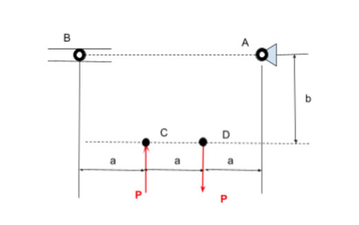

## Analyze
The truss geometry was designed to be simple while still satisfying the loading and support requirements. I selected a seven-member layout because it provides a stable structure while keeping the overall weight low. The dimensions of the truss were based on the required values of a=0.4 and b=0.3.

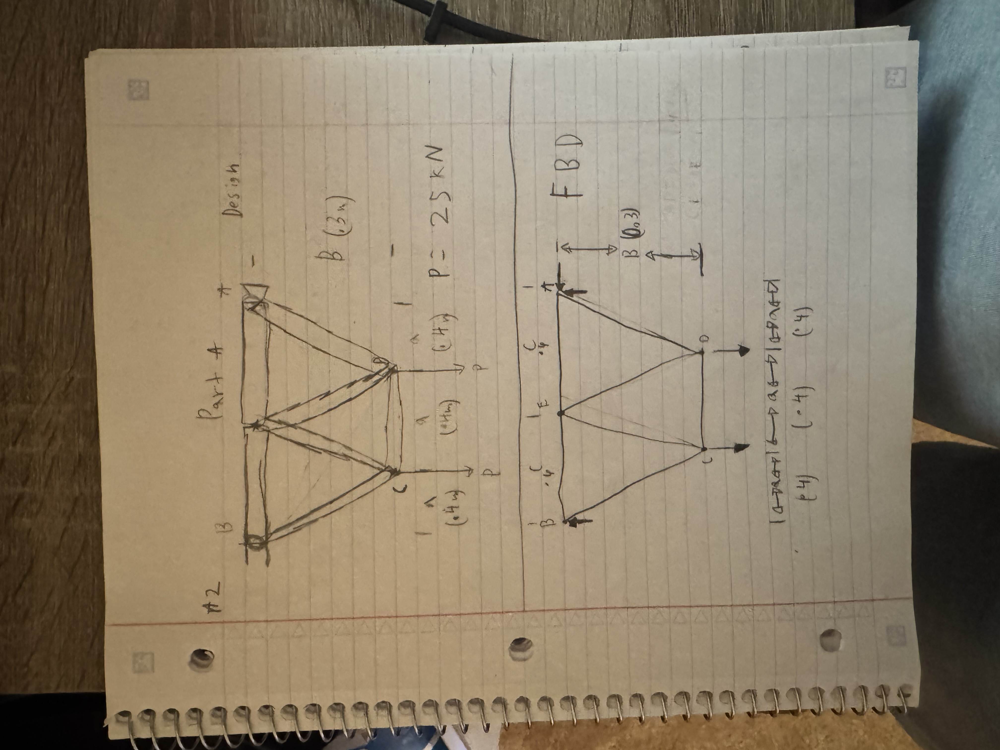

After finalizing the geometry, I calculated the external reaction forces at the supports. I first took the moment about point A to solve for the reaction at B, then used vertical force equilibrium to determine the reaction at A. Horizontal force equilibrium was also used to confirm that the horizontal reaction at A was zero.

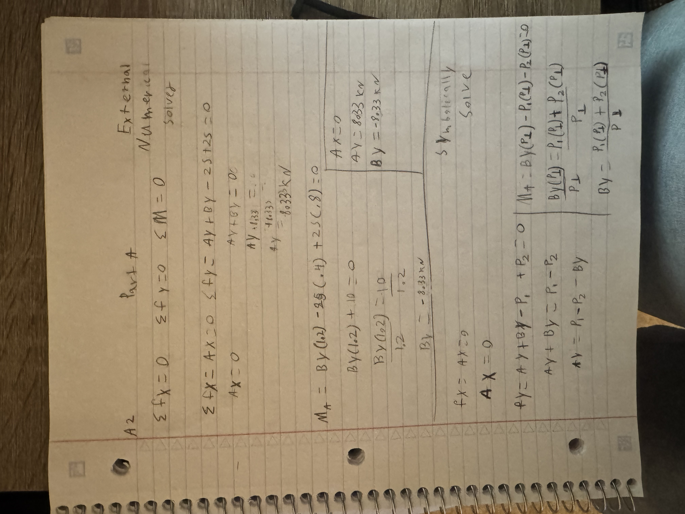

Once the external reactions were known, I used the method of joints to determine the internal force in each truss member. I began at joint A and continued through the remaining joints until all member forces were found. These calculations allowed me to identify which members were in tension, which were in compression, and which member carried the largest internal force.

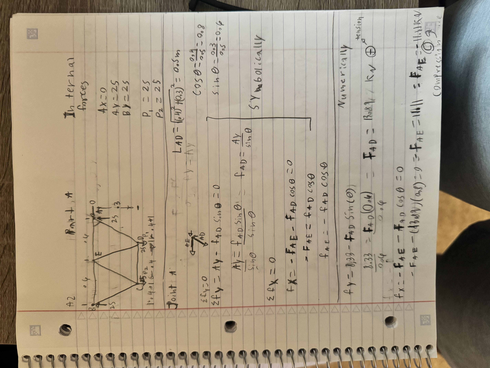

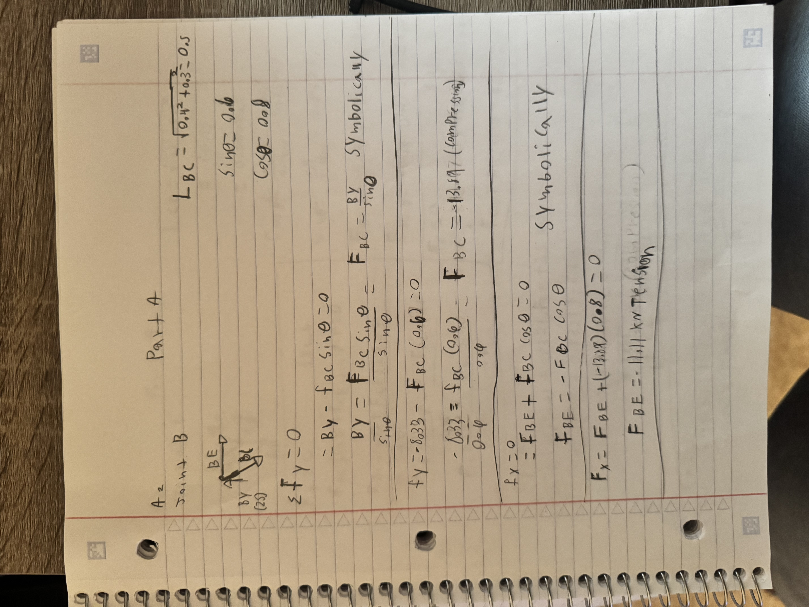

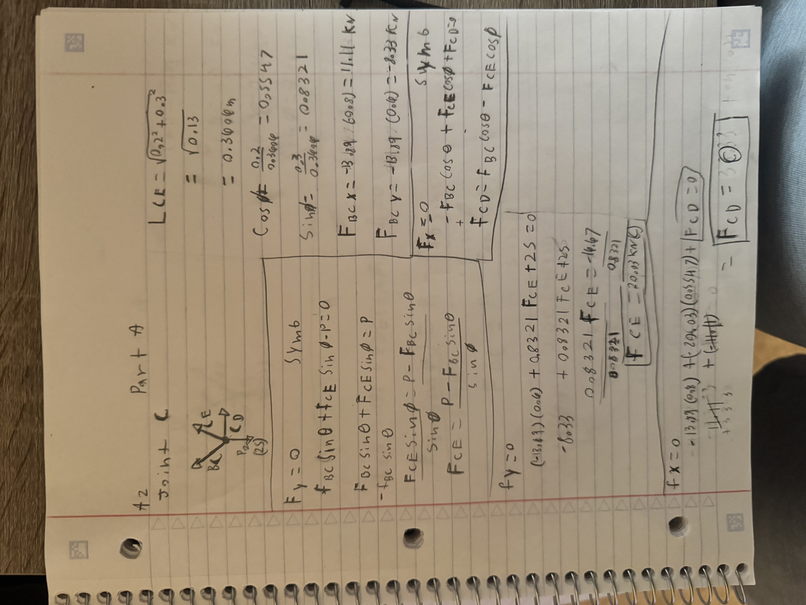

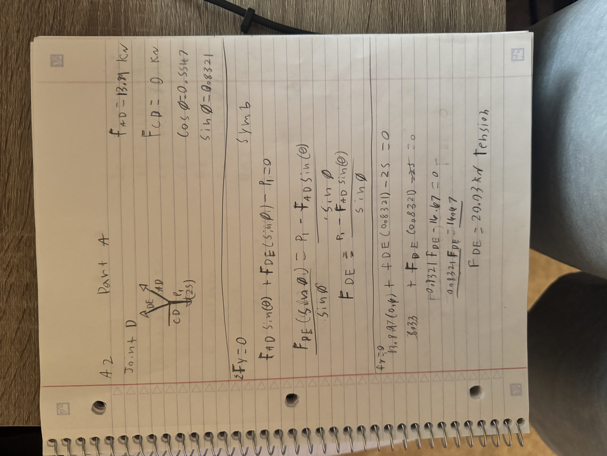

The internal forces were important because they determined the minimum required cross-sectional area of the truss members. Using the largest internal force, the yield strength of A500 steel, and a safety factor of 3.5, I calculated the minimum cross-sectional area to be approximately 221mm^2. To provide a small design margin while keeping the truss lightweight, I selected a cross-sectional area of 250mm^2 for the CAD model. 

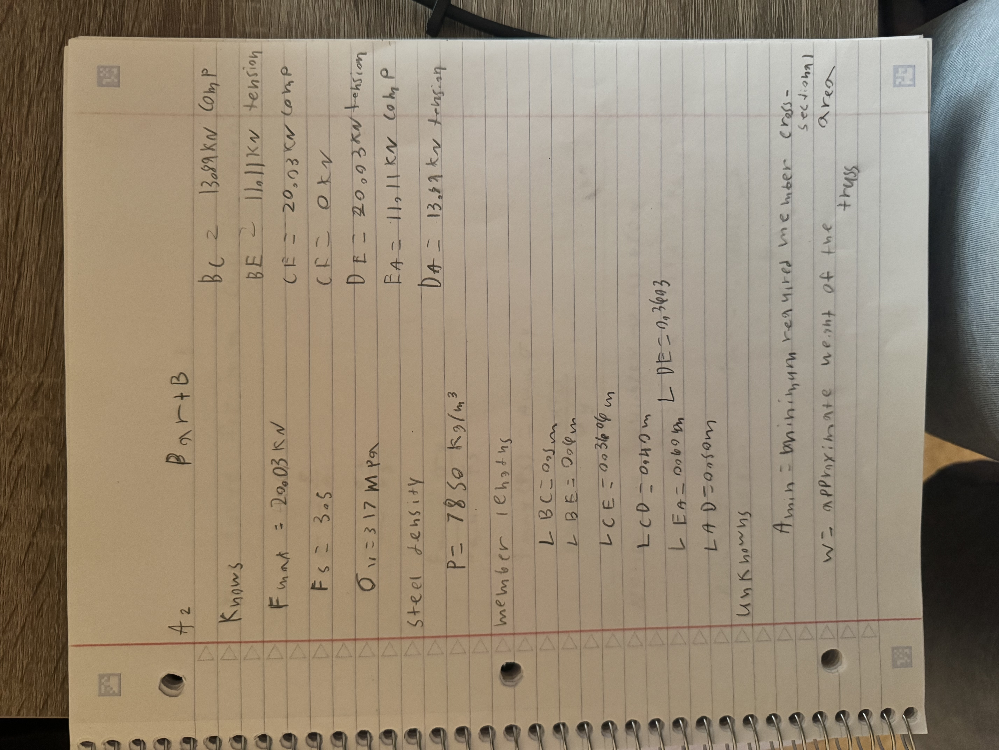

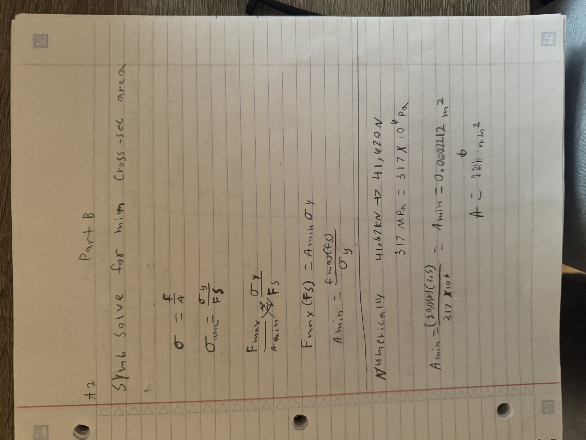

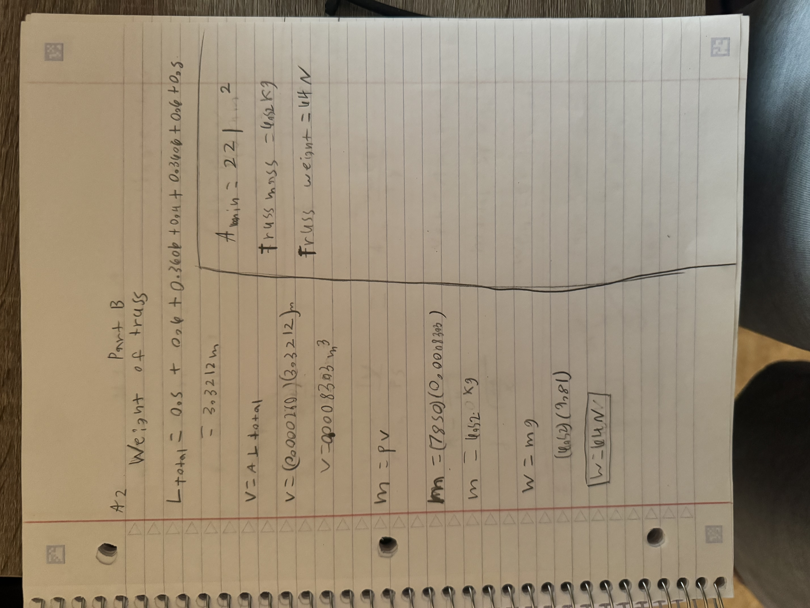

Using the selected cross-sectional area and the total length of all seven members, I estimated the mass of the truss. The calculated mass was approximately 6.52kg, which corresponds to a weight of about 64N.

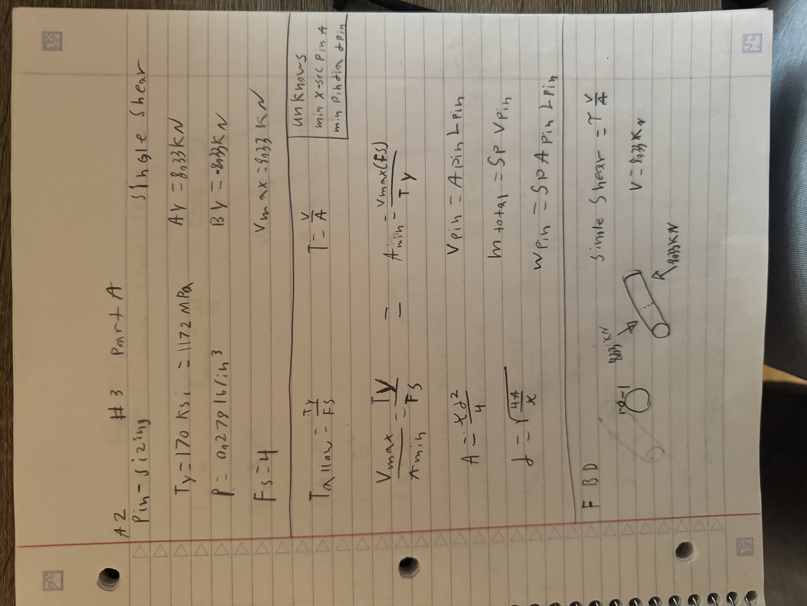

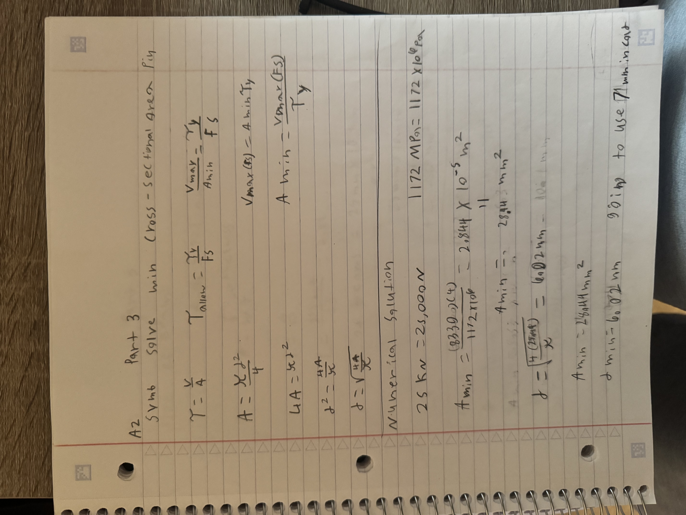

After sizing the truss members, I designed the connecting pins. The pins were analyzed in single shear using the largest support reaction, a shear yield strength of 170 ksi, and a safety factor of 4. The minimum required pin diameter was approximately 6.02 mm, so I selected a 7 mm diameter pin for the final design.

With the truss members and pins fully sized, I created the truss in CAD using the calculated geometry and dimensions. The CAD model represents the final design and provides a way to verify the analytical calculations through mass properties and structural analysis. This final step connects the hand calculations to the physical geometry of the truss.

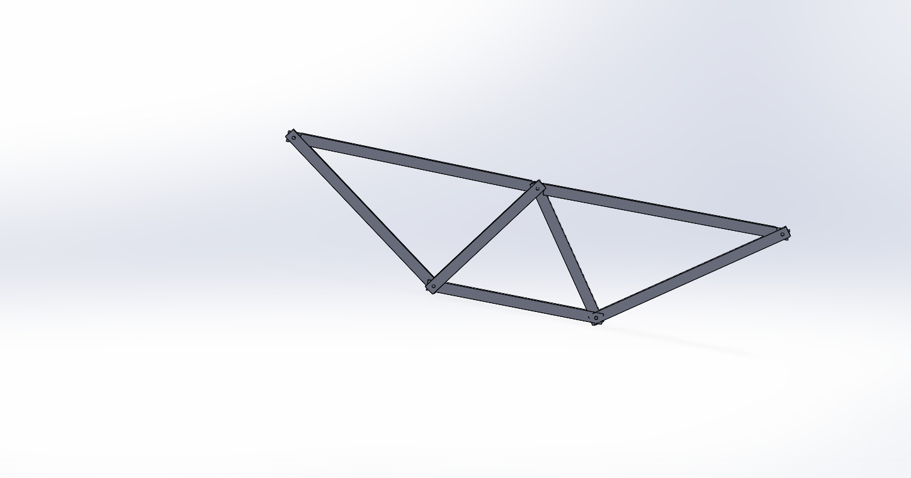

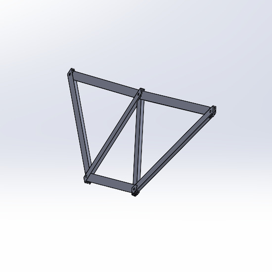

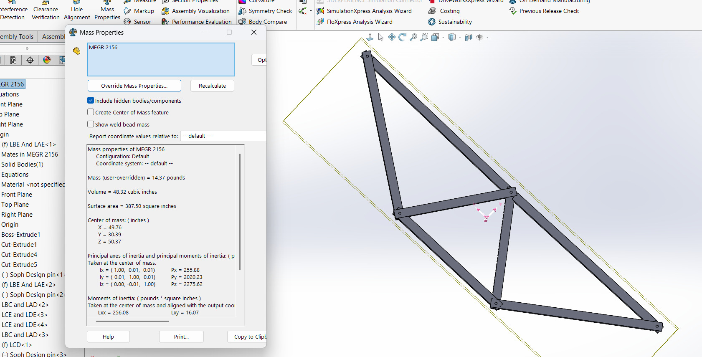

[truss.zip](https://github.com/Agraha74/megr2157-portfolio/blob/main/docs/assignments/A02/drive-download-20260530T220347Z-3-001.zip)

## Decide
_Which geometry did you select, and why? This is your first open design choice in the course — defend it._

I selected a simple seven-member truss geometry because it provided a stable structure while keeping the number of members and overall weight low. The triangular layout helps transfer the applied loads efficiently through axial tension and compression rather than bending. I also chose this geometry because it is easy to analyze with the method of joints and straightforward to reproduce accurately in CAD.

