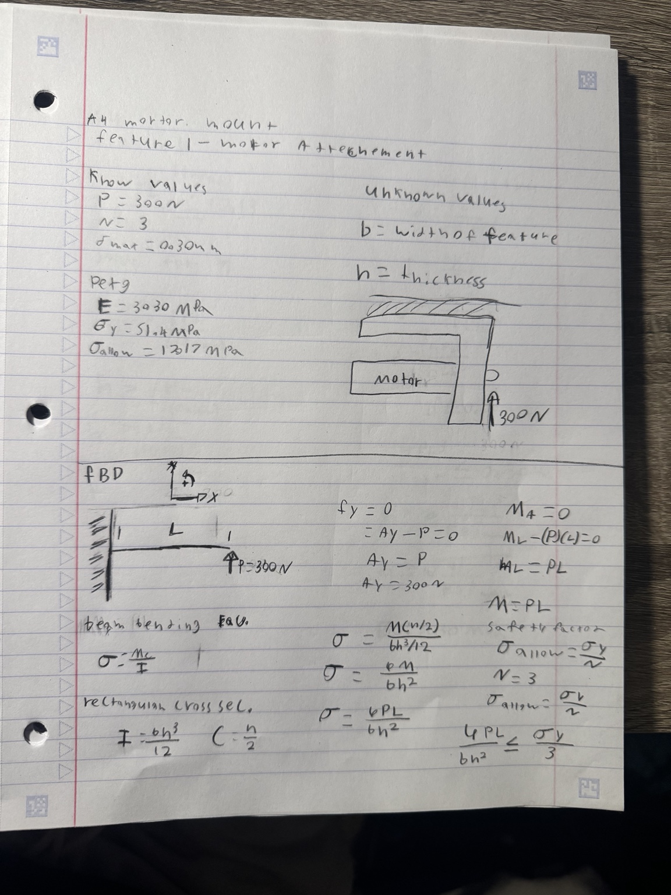
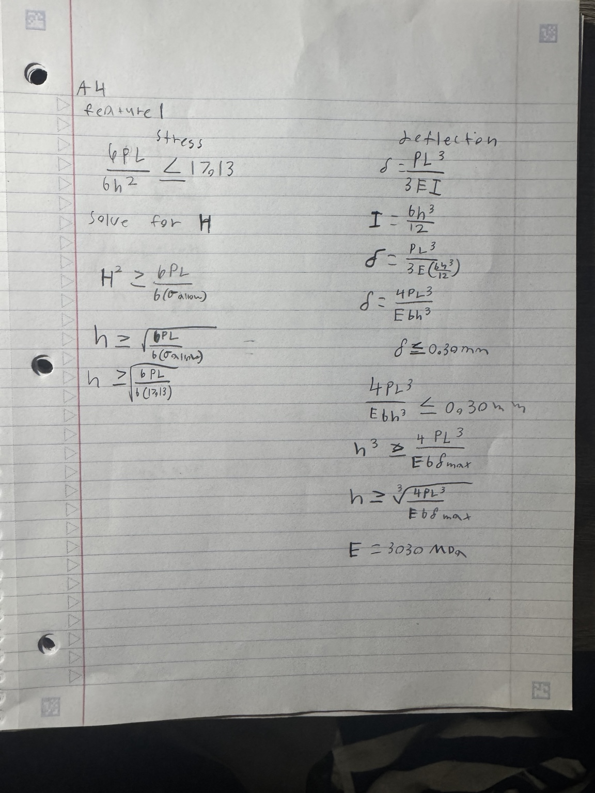
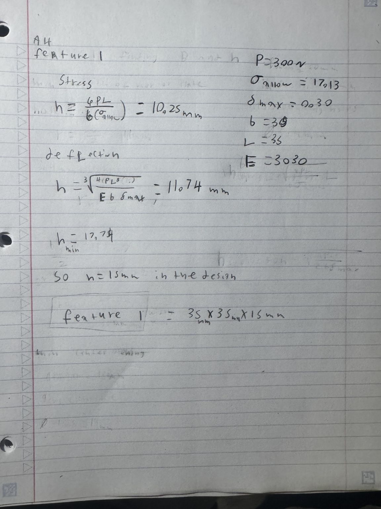
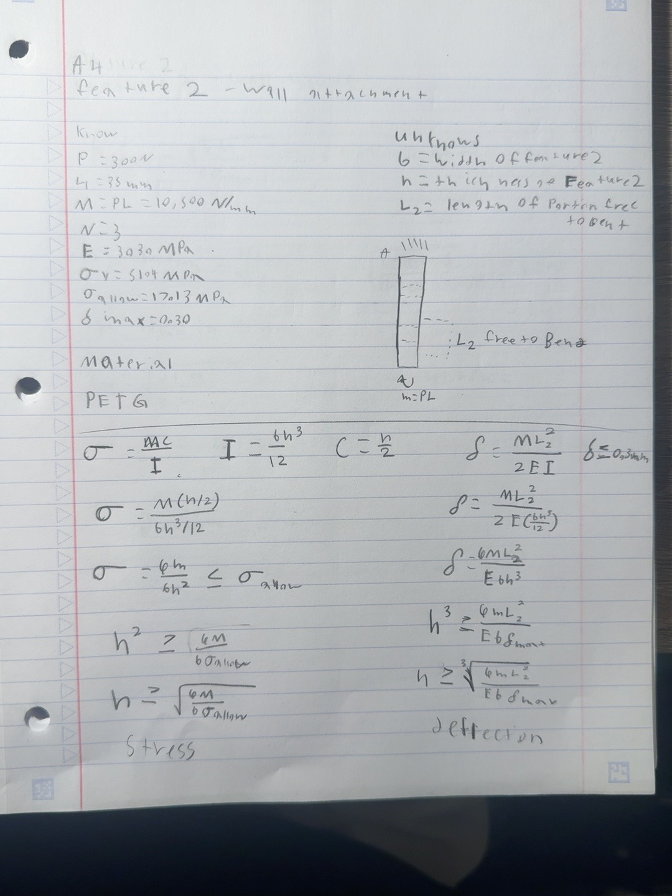
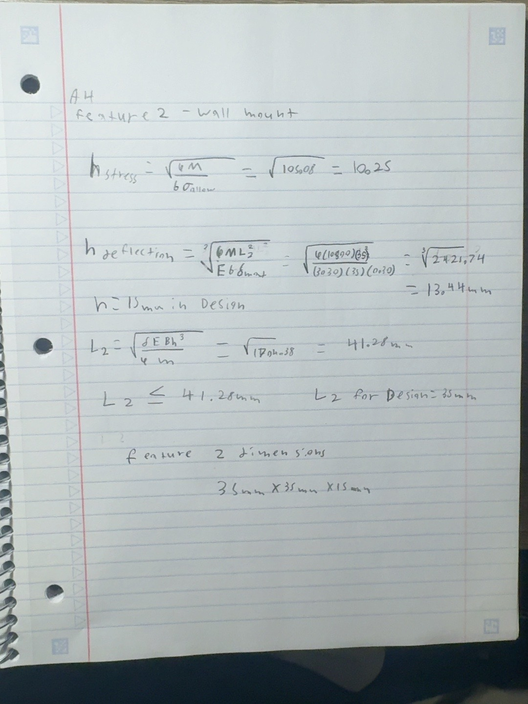

# A4 – Motor Mount

## Objective
The objective of this assignment is to design a motor mount that can safely support a 24 V DC brushed motor under a 300 N load. The design must satisfy both stress and deflection requirements while using an appropriate material and safety factor. The final design will be supported with hand calculations, sketches, and a parametric CAD model.
## Analyze
Design requirements: 
The mount must support a 300 N force, have a safety factor of 3, and be under the max deflection of .3mm, must be made out of one of these 3 materials (ABS, PETG, PLA). Final design needs 3.4mm clearance for the bolts. 

## Motor Research 

Dimensions in MM

The motor dimensions were researched to properly size the mounting plate, shaft clearance hole, and mounting holes.

## Material Research

ABS: ABS is a tough and impact-resistant plastic that works well for functional parts. From the material data, ABS has a Young’s Modulus of 1.79–3.20 GPa and a tensile yield strength of 29.6–48 MPa. This gives ABS a good balance between stiffness, strength, and toughness.

PETG: PETG is a durable material with good impact resistance and is generally less brittle than PLA. From the material data, PETG has a Young’s Modulus of 1.10–20.3 GPa and a tensile yield strength of 28.3–101 MPa, depending on the specific grade. The MatWeb data shown gives average values of about 3.03 GPa for Young’s Modulus and 51.4 MPa for yield strength.

PLA: PLA is generally a stiff plastic, which can help reduce deflection in a loaded bracket. Based on the material data shown, the average Young’s Modulus is about 2.35 GPa, and the average tensile yield strength is about 45.2 MPa. PLA can provide good stiffness, but it is typically more brittle than ABS or PETG.

## Selected Material

PETG was selected as the material for the motor mount because it provides a strong balance of strength, stiffness, toughness, and impact resistance. Based on the material values used in this comparison, PETG has a yield strength of 51.4 MPa, an allowable stress of 17.13 MPa with a safety factor of 3, and a Young’s Modulus of 3.03 GPa. These values indicate that PETG should perform well under the required load while also providing good resistance to cracking and vibration.

| Material | Yield Strength | Young’s Modulus | Allowable Stress, SF = 3 |
| -------- | -------------: | --------------: | -----------------------: |
| ABS      |       29.6 MPa |        1790 MPa |             **9.87 MPa** |
| PETG     |       51.4 MPa |        3030 MPa |            **17.13 MPa** |
| PLA      |       45.2 MPa |        2350 MPa |            **15.07 MPa** |

## Feature 1
Feature 1 is the horizontal portion of the motor mount that supports the motor. This feature was modeled as a cantilever beam with a 300 N force applied at the free end. The goal was to determine the required cross-sectional dimensions so that the feature would remain below both the allowable stress and the maximum deflection of 0.30 mm.

Knowns, Unknowns, and FBD

The known values were first identified, including the 300 N applied force, a safety factor of 3, the PETG material properties, and the maximum allowable deflection of 0.30 mm. A free-body diagram was then created by modeling Feature 1 as a cantilever beam. The FBD was used to determine the reaction force and maximum bending moment, where M = PL.

Next, the bending stress and cantilever beam deflection equations were solved symbolically. For the stress analysis, the rectangular moment of inertia and bending equation were combined to solve for the required thickness, h. The deflection equation was also rearranged to solve for the minimum thickness needed to keep the deflection below 0.30 mm.

For the numerical analysis, a width and length of 35 mm were selected for Feature 1. The PETG material properties and design requirements were substituted into the symbolic equations. The stress calculation resulted in a minimum thickness of 10.25 mm, while the deflection calculation resulted in a minimum thickness of 11.74 mm.

Since the deflection analysis required the larger minimum thickness of 11.74 mm, deflection controlled the design. A final thickness of 15 mm was selected to provide additional design margin above the calculated minimum. The final dimensions of Feature 1 were selected as 35 mm × 35 mm × 15 mm.

## Feature 2
Feature 2 is the vertical portion of the motor mount that attaches the mount to the rigid wall. The load on Feature 1 creates a moment that is transferred into Feature 2. The goal was to determine the cross-sectional geometry that would keep Feature 2 below both the allowable stress and maximum deflection.

Knowns, Unknowns, and Symbolic Analysis

The moment transferred from Feature 1 was calculated using M = PL, resulting in a moment of 10,500 N·mm. PETG was used with a Young's Modulus of 3030 MPa and an allowable stress of 17.13 MPa. Feature 2 was modeled using the portion of the wall attachment that is free to bend. The beam bending and deflection equations were then solved symbolically for the required thickness. The maximum allowable deflection was set to 0.30 mm.

For the numerical analysis, a width of 35 mm and a free-to-bend length of 35 mm were used. The stress analysis resulted in a minimum required thickness of 10.25 mm, while the deflection analysis resulted in a minimum thickness of 13.44 mm

Since the deflection analysis required the larger thickness, deflection controlled the design. A final thickness of 15 mm was selected to provide additional design margin above the calculated minimum.

The final dimensions selected for Feature 2 were 35 mm × 35 mm × 15 mm.

## Decide

## Communicate

