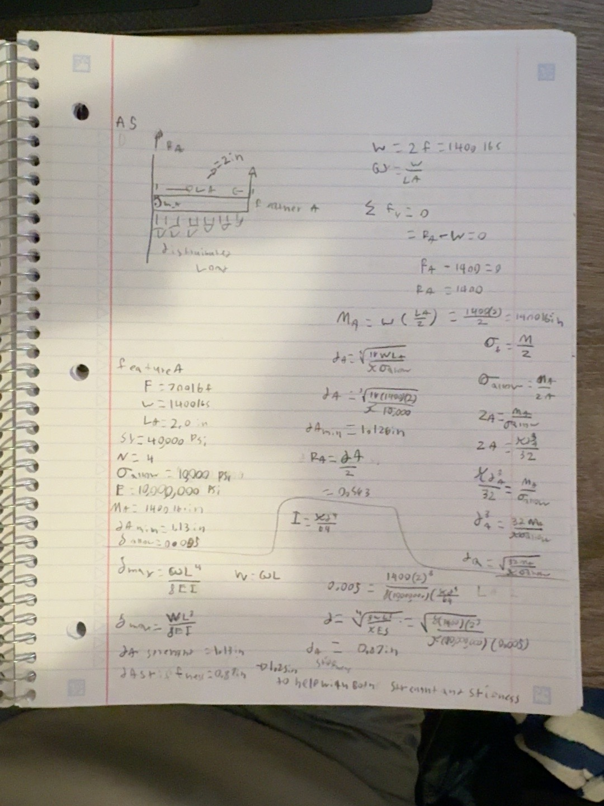
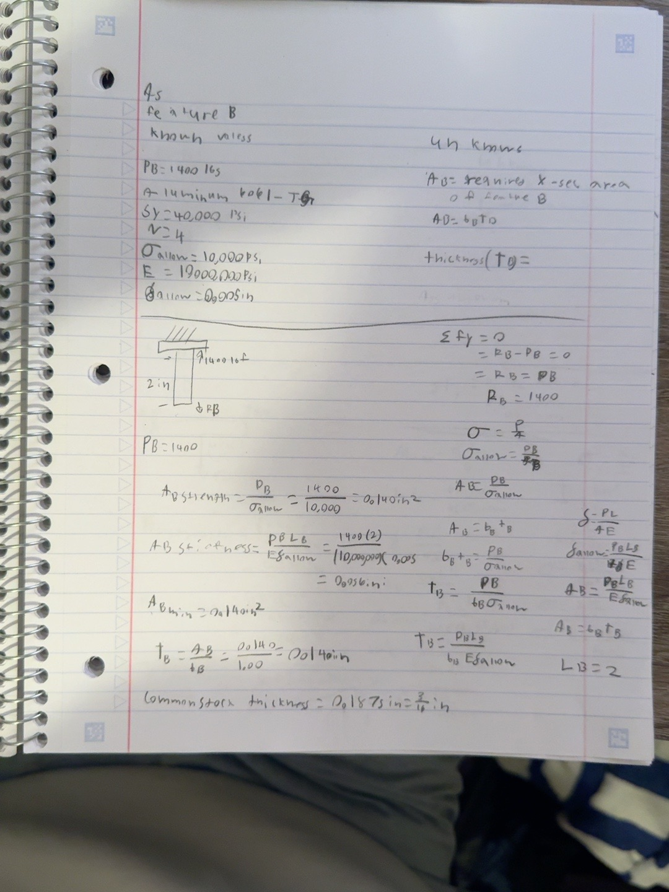
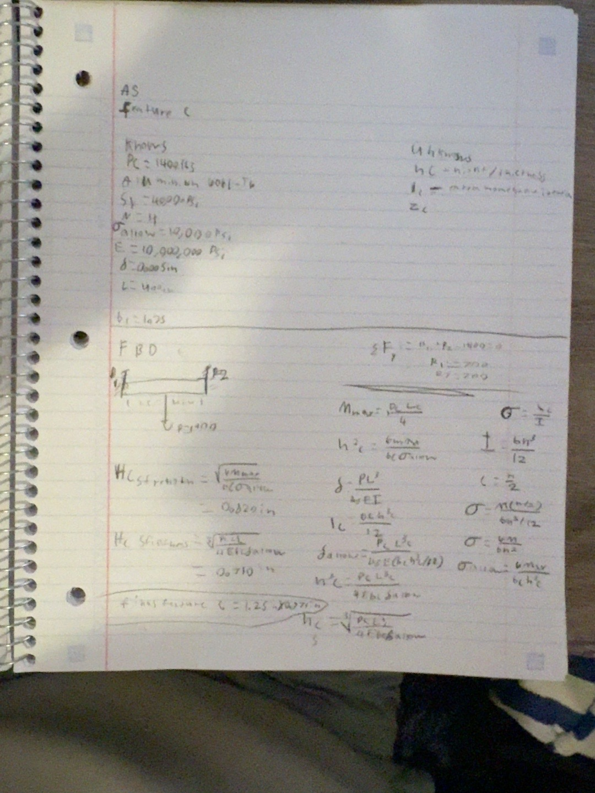
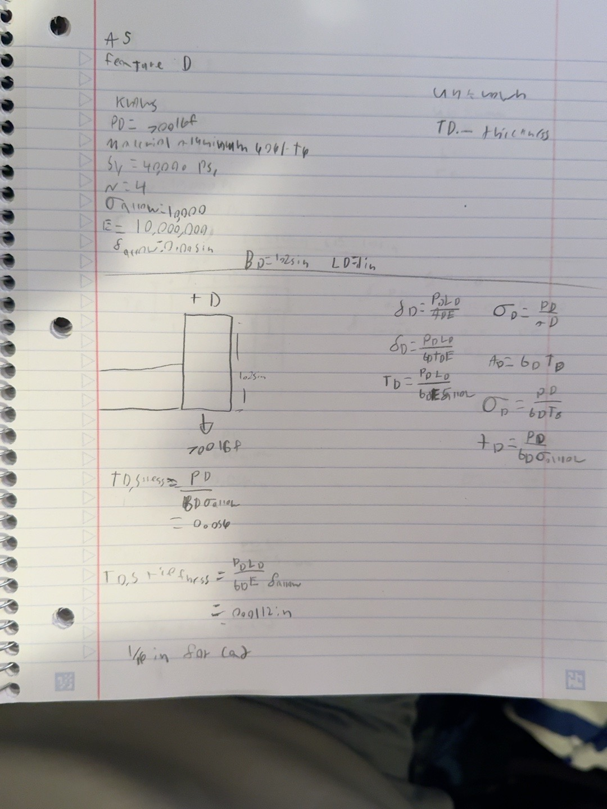
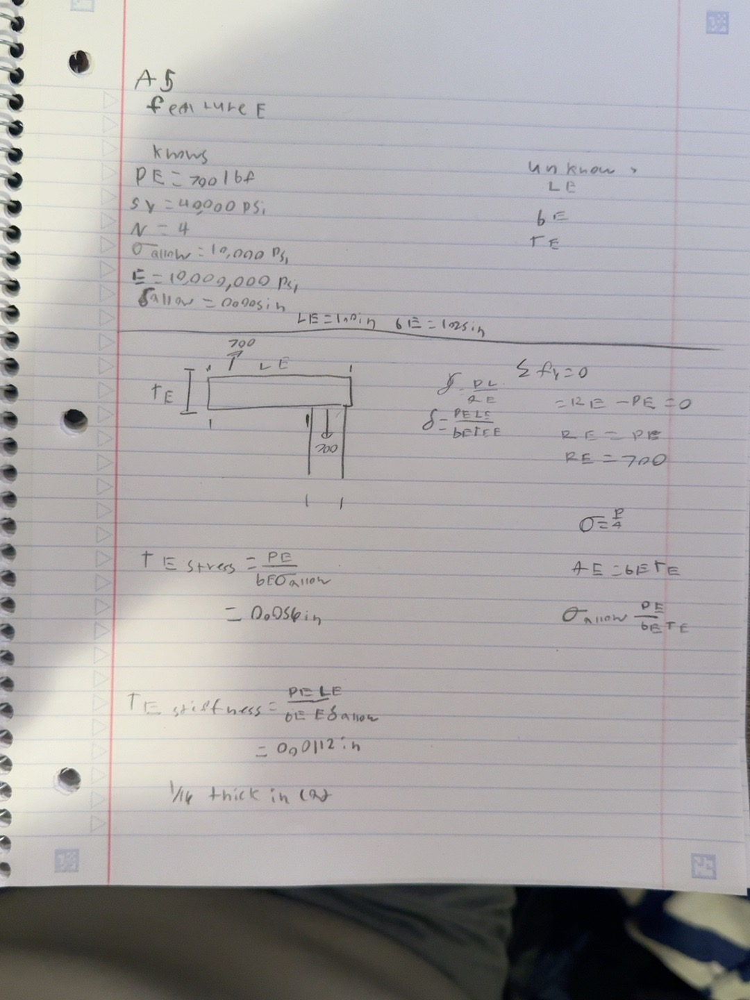
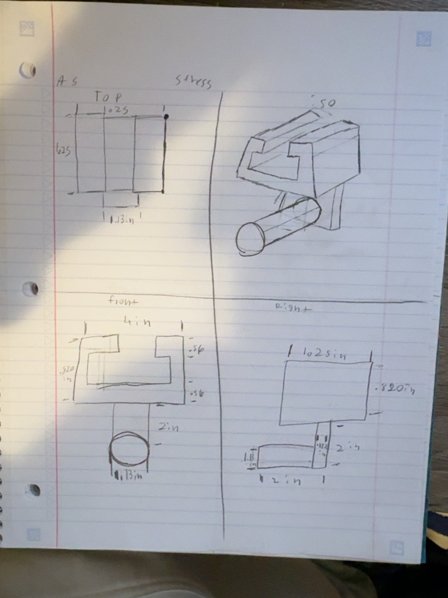
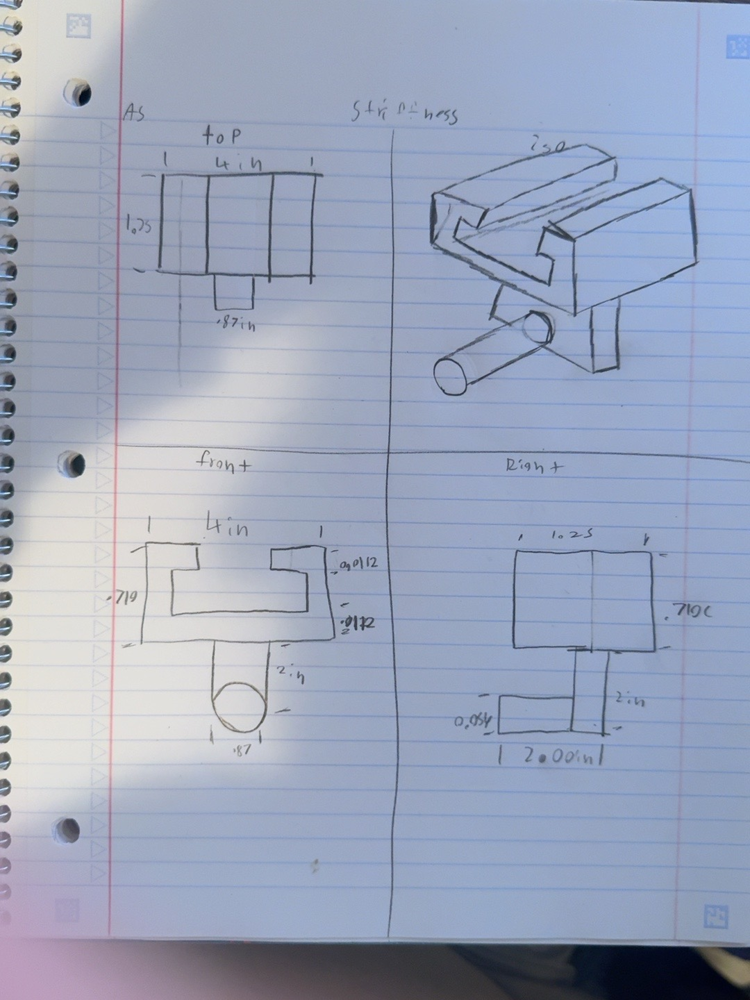

# A5 – Bracket Decign

### Objective

The objective of this project is to design a structural bracket capable of supporting the required applied load using strength and stiffness analysis. Free-body diagrams, normal and bending stress equations, and deflection equations are used to determine the minimum dimensions of each feature while maintaining the required factor of safety and deflection limit.

# Design Inputs

For this project, I selected an applied load of:

F = 700 lbf

Since the strap applies force on both sides:

W = 2F

W = 1400 lbf

The selected material is:

Aluminum 6061-T6

Material properties used:

S_y = 40,000 psi

E = 10,000,000  psi

The required factor of safety is:

N = 4

The allowable stress is:

sigma_allow = 10,000 psi

The maximum allowable deflection for each feature is:

delta_allow= 0.005 in

# Feature A

Feature A is the cylindrical member that supports the polyester strap. It is modeled as a cantilever beam with a uniformly distributed load.

## Known Values

F = 700 lbf

W = 1400 lbf

L_A = 2.0 in

S_y = 40,000 psi

sigma_allow = 10,000 psi

E = 10,000,000 psi

delta_allow= 0.005 in

Unknowns

Determine the required section modulus and diameter of Feature A.

Z_A = ?

d_A = ?

Assumptions

- Feature A is treated as a cantilever beam.
- The strap load is uniformly distributed across Feature A.
- The connection between Feature A and Feature B is treated as fixed.
- Direct shear failure is neglected.
- The material remains within the linear-elastic range.
- The cross section is constant.
- Deflections are assumed to be small.

# Feature B

Feature B is modeled as an axially loaded rectangular bar.

## Known Values

P_B = 1400 lbf

L_B = 2.0 in

S_y = 40,000 psi

sigma_allow=10,000 psi

E=10,000,000 psi

delta_allow=0.005 in

## Unknowns

A_B=?

t_B=?

## Assumptions

- Feature B is treated as a straight axially loaded member.
- The load acts through the centroid of the cross section.
- Bending is neglected.
- Direct shear is neglected.
- The cross section is constant.
- Aluminum remains within the linear-elastic range.
- Deformations are small.

# Feature C

Feature C is modeled as a simply supported beam with a concentrated load at the center.

## Known Values

P_C=1400lbf

L_C=4.0 in

b_C=1.25 in

S_y=40,000 psi

sigma_allow=10,000 psi

E=10,000,000 psi

delta_allow=0.005 in

## Unknowns

h_C=?

## Assumptions

- Feature C is treated as a simply supported beam.
- The 1400 lbf load is applied at the center.
- The cross-section is rectangular and constant.
- Bending is the primary loading mode.
- Direct shear failure is neglected.
- Shear deflection is neglected.
- The material remains linear elastic.
- Deflections are small.

# Feature D

The reaction force from Feature C becomes the applied load for Feature D.

Since:

R_1=R_2=700 lbf

the applied load for one side of Feature D is:

P_D=700 lbf

## Known Values

P_D=700 lbf

S_y=40,000 psi

sigma_allow=10,000 psi

E=10,000,000 psi

delta_allow=0.005 in

L_D=1

b_D=1.25

## Unknowns

t_D=?

## Assumptions

- Feature D is treated as an axially loaded member.
- The 700 lbf load acts through the centroid of the cross-section.
- Bending is neglected.
- Direct shear failure is neglected.
- The cross-section is constant.
- Aluminum 6061-T6 remains in the linear-elastic range.
- Deflections are small.

**Insert Feature D FBD here**

# Feature E

Feature E transfers the load from Feature D into the rigid T-beam.

## Known Values

P_E=700 lbf

S_y=40,000 psi

sigma_allow=10,000 psi

E=10,000,000 psi

delta_allow=0.005

L_E=1.0 in

## Unknowns

t_E=?

## Assumptions

- Feature E carries the load transferred from Feature D.
- The load is assumed to act through the center of the member.
- The cross section is constant.
- Aluminum 6061-T6 remains in the linear-elastic range.
- Direct shear failure is neglected.
- Shear deformation is neglected.
- Deflections are small.

# Overall Stress and Stiffness Comparison

| Feature | Stress Requirement | Stiffness Requirement | Governing Requirement | Final Dimension |
|---|---:|---:|---|---:|
| A | 1.13 in | 0.87 in | Stress | 1.25 in |
| B | 0.140 in² | 0.056 in² | Stress | 0.1875 in thickness |
| C | 0.820 in | 0.710 in | Stress | 0.875 in |
| D | 0.056 in | 0.0112 in | Stress | 0.0625 in |
| E | 0.056 in | 0.0112 in | Stress | 0.0625 in |

# Decide

# Multiview Drawings

Two detailed multiview drawings will be included: one showing the dimensions determined from stress analysis and one showing the dimensions determined from stiffness analysis.

# Lessons Learned

## Governing Failure Mode

For the features completed so far, stress has governed the required dimensions.

Feature A:

d_stress=1.13 in

d_stiffness=0.87in 

Feature C:

h_stress=0.820 in

h_stiffness=0.710 in

This demonstrates that both strength and stiffness calculations are necessary because either requirement could potentially control the final design.

## Error Propagation

The forces found in one feature are used as the applied loads for the next feature. Because of this, an incorrect reaction force early in the analysis would affect all later calculations. For example, Feature C splits the 1400 lbf load into two 700 lbf reactions. These reactions become the loads used to design the upper features.

## Assumption Sensitivity

One major assumption in the project is that direct shear failure and shear deflection are negligible. If shear effects were included, additional deformation and stress could increase the required dimensions of some features. 

## Project Time

Total time spent on the project: 7 hours 
\]

