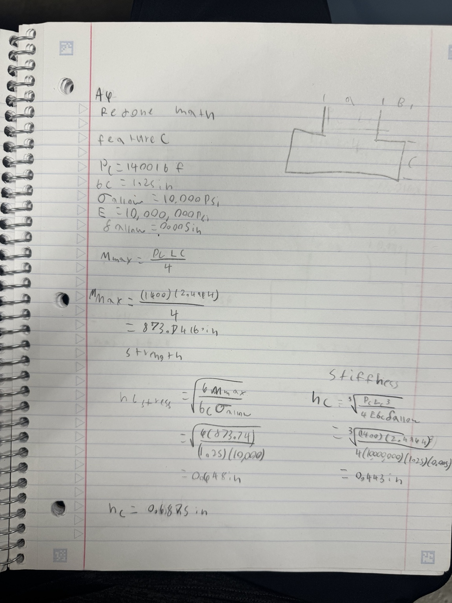
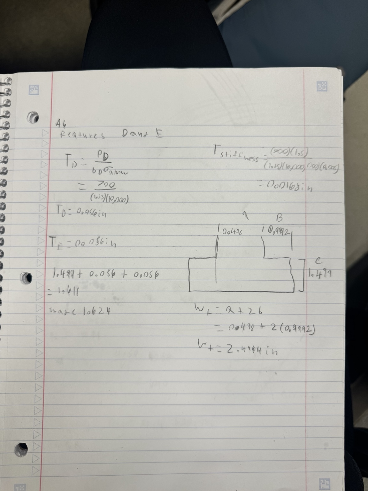
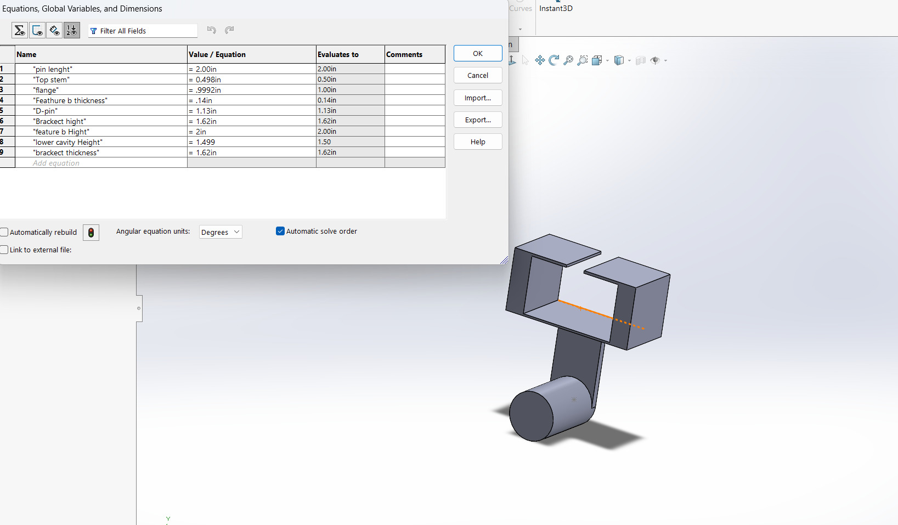

# A6 – [Drawings 1]

## Objective
The objective of this assignment is to create a parametric SolidWorks model and fully dimensioned engineering drawing of the bracket using dimensions developed from the previous strength and stiffness analysis. The design must also incorporate the rigid T-beam fit requirements, engineered tolerances, and a drawing that clearly communicates the final geometry and functional dimensions.

## Design requirements 

The bracket was designed to attach to a rigid T-beam and hold a polyester strap. The updated T-beam specifications used for the interface were:

(a = 0.498) in

(b = 0.9992) in

(c = 1.499) in

The material selected for the bracket was aluminum 6061-T6.

Yield strength: (S_y = 40,000 ) psi

Elastic modulus: (E = 10,000,000 ) psi

Factor of safety: 4

Allowable stress:  10,000 psi

Maximum allowable deflection: 0.005 in

## Math redo
I had to redo some of my math from the last assignment because I failed to implement the t-bar requirements correctly.

## CAD Model
I then recreated the design from the previous assignment in SolidWorks, making a few small changes as I worked through the model. I used global variables to control the main dimensions so that any later adjustments could be made quickly without having to edit each feature individually.

## CAD drawing
I then created a detailed engineering drawing of the finished bracket to clearly communicate the final design. I included the necessary orthographic views, dimensions, tolerances, and an isometric view so the part could be understood without opening the SolidWorks model.

## Reflections
For Feature A, I used the bending strength equation to determine the required diameter of the cylindrical strap support. The calculation gave a required diameter of 1.13 in. I used this value as a global variable in SolidWorks, so the feature could be changed more easily if the design was updated. I also revised Feature C after changing its span from 4.00 in to 2.4964 in, which changed its required height from about 0.820 in to 0.648 in.

For tolerances, I used a tighter tolerance on the 0.498 in T-beam mating feature because it directly affects the sliding fit between the bracket and the T-beam. I used a looser tolerance on non-critical dimensions such as the 2.0 in cylindrical support length. Using tighter tolerances only where they are needed helps maintain proper fit without making the part unnecessarily difficult or expensive to manufacture.

## Communicate
This project took me 4 hours

[Cad & Darwing]: (https://github.com/Agraha74/megr2157-portfolio/blob/main/docs/assignments/A06/Megr%202157%20A6.SLDPRT)
(https://github.com/Agraha74/megr2157-portfolio/blob/main/docs/assignments/A06/Megr%202157%20A6.SLDDRW)
